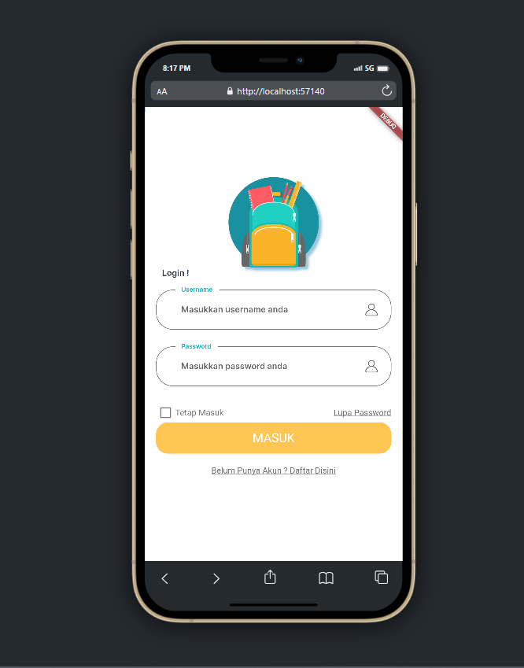
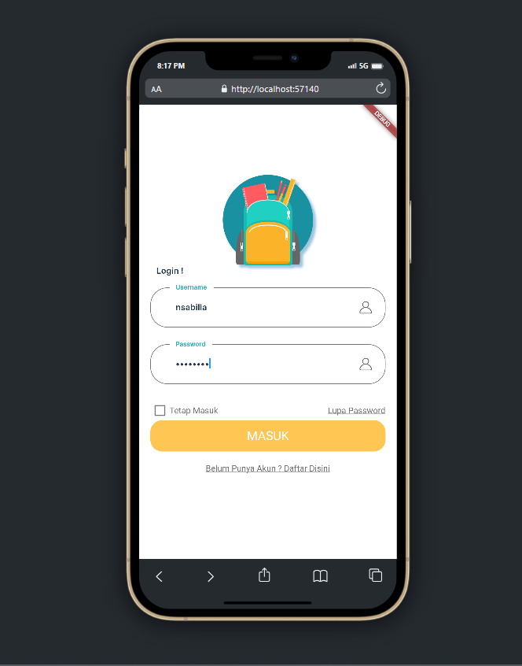

# Page Login dengan Flutter

**
Nama: Nurul Najwa Sabilla
**
**
Kelas: TI.21.A.3
**
**
NIM: 312110451
**
**
Hari, Tanggal  : Selasa, 16 Mei 2023
**

## Output 

Saya, membuat tampilan login untuk  “Toko Tas”. Terlihat pada tampilan login tertapat: icon; header; field/kolom username dan password; cek box; forgot password; button login/masuk.

Berikut, hasil tampilan sebelum dan sesudah mengisi field:

